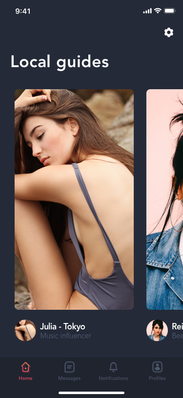
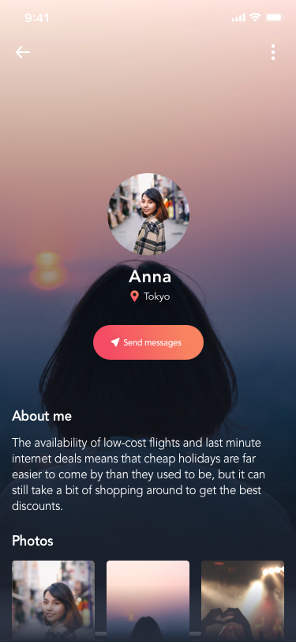
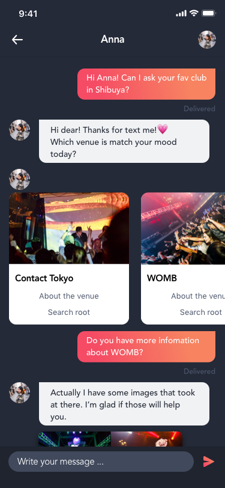

# Project Julia AI　

## Overview 📱

Project Julia AIは、ナイトライフコンテンツをメインに、現地の人から支持されているお店やイベント、アクティビティ等の情報を集積し、ワンストップかつ網羅的に情報提供するチャットボットのスマホアプリ開発プロジェクトです。

現地の女性を想起させるGANで作られた容姿を持ち、自然言語処理でユーザーの言葉を理解し、旅行の思い出も共有してくれる旅の良きアドバイザーが必要な時いつも側にいるかのようなリアルなUXの提供を目指します。

- Frontend: Flutter
- NLP: Dialogflow
- Backend: TBA

## ScreenShots 📸

**Some screenshots below**
 

| | |
| ------ | ------- |
|||
|||

[**Check More ScreenShots**](https://projects.invisionapp.com/share/YCVSJFUSWAQ#/screens/402740858)
 

## Licence 🏷
Project Julia AI is licensed under the terms of the GPL Open Source license and is available for free.

## Author 👨

- Tatsuya Tsuri
- Freelance Web Developer
- Facebook : <https://www.facebook.com/tatsuya.tsuri>
- LinkedIn : <https://www.linkedin.com/in/tatsuya-tsuri/>
